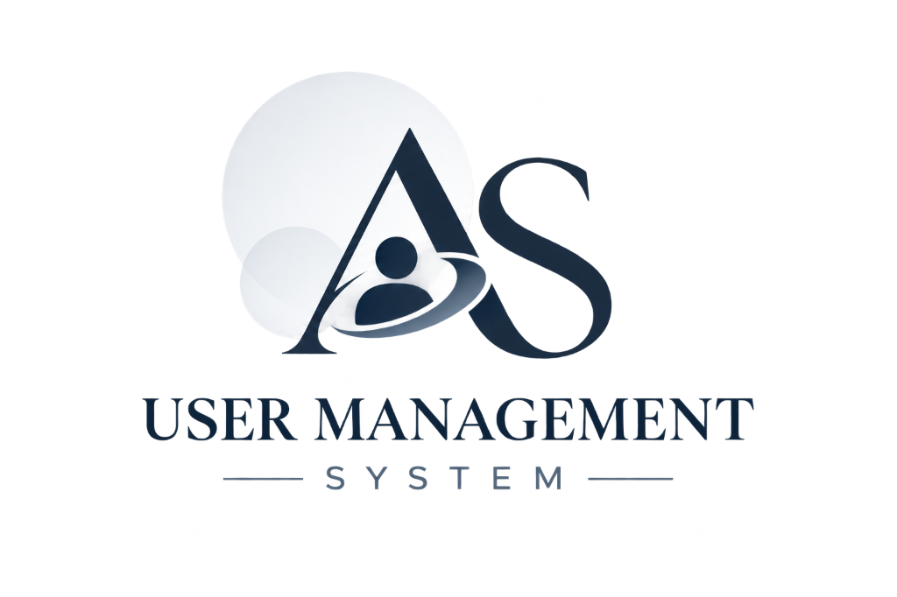

# 🏢 Aksiyonsoft - User Management System (UMS)

**Aksiyonsoft User Management System**, şirket içi çalışanların, departmanların, güvenlik oturumlarının ve kişisel profillerin merkezi olarak yönetildiği **Next.js** tabanlı, kurumsal (Enterprise) düzeyde bir web uygulamasıdır.



## ✨ Öne Çıkan Özellikler

- **🔒 Gelişmiş Kimlik Doğrulama:** Özel oturum yönetimi, HTTP-Only Cookie tabanlı token sistemi ve şifre güvenliği (`crypto.scryptSync` hashing).
- **🛡️ Oturum ve Cihaz Kontrolü:** Kullanıcıların açık olan cihaz/tarayıcı oturumlarını (Session) görüntülemesi ve uzaktan sonlandırabilmesi (Revoke).
- **🏢 Departman (Section) Yönetimi:** Şirket içi departmanların oluşturulması ve kullanıcılara atanması (İlişkisel Veritabanı Mimarisi - Left Join).
- **🧑‍💻 Kapsamlı Profil Sistemi:** Kullanıcılara ait temel bilgilerin yanı sıra aile, eş/kız arkadaş ve genişletilmiş detay kartları (CRUD işlemleri tam destekli).
- **🎨 Premium UI/UX Tasarım:** Tailwind CSS ve Lucide-React ile geliştirilmiş modern, "Zinc/Indigo" renk paletine sahip profesyonel arayüz. Eşzamanlı Form state yönetimi ve animasyonlu bildirim (Toast) sistemi.
- **🚦 Güvenlik Middleware'i:** Rota (Route) bazlı yetkilendirme. Giriş yapmamış kullanıcıların korumalı sayfalara ve API endpoint'lerine erişimi Next.js Middleware seviyesinde kesilir.

## 🛠️ Teknoloji Yığını (Tech Stack)

| Kategori | Teknoloji |
| :--- | :--- |
| **Framework** | Next.js 14+ (App Router) |
| **Dil** | TypeScript |
| **Veritabanı** | PostgreSQL (Docker üzerinden) |
| **ORM** | Drizzle ORM |
| **Stil / UI** | Tailwind CSS, Lucide React |
| **Şifreleme** | Node.js Crypto Modülü |

## 🚀 Başlangıç ve Kurulum

Projeyi yerel ortamınızda (local) çalıştırmak için aşağıdaki adımları izleyin.

### 1. Önkoşullar
- **Node.js** (v18 veya üzeri)
- **Docker Desktop** (PostgreSQL veritabanını ayağa kaldırmak için)

### 2. Projeyi Klonlayın
```bash
git clone https://github.com/ugurlufurkan/user-management-system.git
cd user-management-system